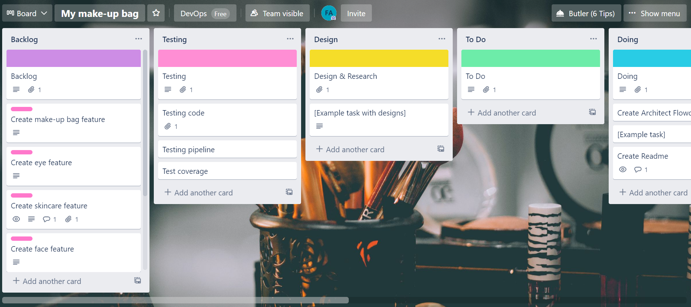

# **My make-up bag**

## **Objective:**

#### My overall objective for this project is to create a CRUD application with the use of supporting tools, methodologies and technologies that encapsulate all core modules covered during our training. I developed the idea to create a make-up bag application where one can add their face,eye or lip products into their bag.

## **Requirements:**

#### **The requirements for this project are as follows:**

#### * A Trello board (with a kanban template) with user stories,use cases and tasks needed to complete the project.
#### * A database used to store data and the database needs to have at least 2 tables in it,and model a relationship between the tables. 
#### * Clear documentation from a design phase describing the architecture you will use for you project as well as a detailed Risk Assessment.
#### * A functional CRUD application created in Python, following best practices and design principles, that meets the requirements set on my Kanban Board.
#### * Fully designed test suites for the application you are creating, as well as automated tests for validation of the application. You must provide high test coverage in your backend and provide consistent reports and evidence to support a TDD approach.
#### * A functioning front-end website and integrated API's, using Flask.
#### * Code fully integrated into a Version Control System using the Feature-Branch model which will subsequently be built through a CI server and deployed to a cloud-based virtual machine.

## **Tech Stack:**

#### **The tech stack required would be the following:**

#### *Kanban Board via Trello
#### *Version Control: GitHub
#### *Programming language: Python
#### *Database: MYSQL
#### *Front-end: Flask (HTML)
#### *Unit Testing with Python (Pytest)
#### *CI Server: Jenkins
#### *Cloud server: GCP Compute Engine

## **Architecture and Flowcharts:**

#### **Entity flowchart:**

#### **Architecture:**

## **Project Management:**

### **Trello-Kanban board:**

#### Please see a link to my Trello Kanban board [Trelloboardlink][https://trello.com/b/FjtS37U8/my-make-up-bag]. I utilised the board to ensure that I was on track to complete the coding for my project on the 19th of March. I moved the features(which included my user stories) and tasks by the format you can see from backlog all the way to done. This is the first time that I am using Kanban in my project planning, but it will not be the last time as this helped me stay on track. I definitely would recommend anyone that is a victim of procrastinating to utilise Trello and the templates that they offer!

## **Contributors/Reference:**

#### My contributors are: Dara Oladapoa and Vinesh Ghela.
#### I used QA-community and https://www.w3schools.com/html as reference.
#### Special thanks to Dara who acted as my traniner and guided me through lessons and my project. 